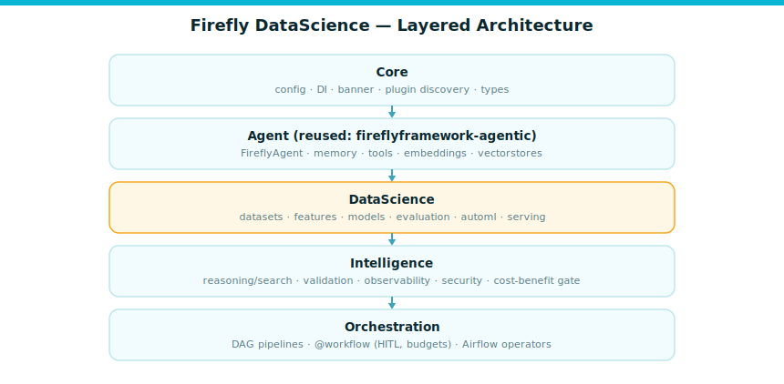
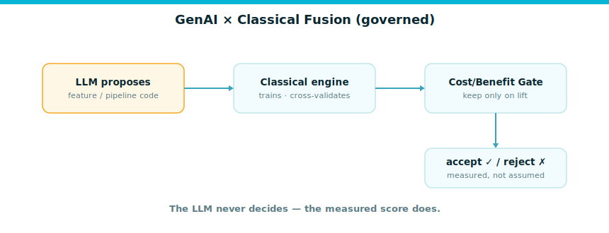

<p align="center">
  
</p>

<h1 align="center">Firefly DataScience</h1>

<p align="center">
  <strong>AutoML that fuses GenAI with classical ML &amp; Deep Learning — hexagonal, secure-by-default, native to the Firefly Framework.</strong>
</p>

<p align="center">
  <a href="#"></a> &nbsp;·&nbsp;
  <a href="LICENSE"></a> &nbsp;·&nbsp;
  <a href="https://github.com/fireflyframework/fireflyframework-agentic"></a> &nbsp;·&nbsp;
  <a href="https://docs.astral.sh/ruff/"></a> &nbsp;·&nbsp;
  <a href="https://microsoft.github.io/pyright/"></a>
</p>

<p align="center">
  <em>The LLM proposes; a deterministic classical engine decides. GenAI is a governed, measurably-gated
  accelerator over a battle-tested classical core — never a black box.</em>
</p>

<p align="center">
  <sub>Copyright 2026 Firefly Software Foundation · Licensed under the Apache License 2.0</sub>
</p>

---

> **Status:** active build. Delivered and green (ruff + pyright + 87 tests): **SP0** Foundation and
> Firefly DNA · **SP1** classical tabular AutoML · **SP2** GenAI feature engineering · **SP3** the
> agentic ML-engineering loop · **SP4** deep-learning / TabFM ports (verified sklearn-MLP; gated
> Torch/TabPFN) · **SP5** serving, lineage and the Lumen credit-risk sample. **SP6** (documentation
> book) is in progress. See [`docs/`](docs/index.md) for the full guide.

## What is this?

`fireflyframework-datascience` is a state-of-the-art Python **metaframework for AutoML**. It combines
**GenAI** (built on [`fireflyframework-agentic`](https://github.com/fireflyframework/fireflyframework-agentic),
which wraps [Pydantic AI](https://ai.pydantic.dev/)) with **traditional ML and Deep Learning**, so any
team can apply data science to any project quickly — with production governance, hexagonal
swappability, and security by default.

- **One reproducible pattern.** The LLM proposes code/features/pipelines/seeds; a deterministic
  classical engine trains, scores, and selects; every GenAI step is gated behind a measured
  improvement over a seeded classical baseline.
- **Hexagonal & swappable.** Every ML/MLOps library (scikit-learn, XGBoost, LightGBM, CatBoost,
  AutoGluon, TabPFN, PyTorch Lightning, HuggingFace, MLflow, Feast, BentoML, …) is a swappable adapter
  behind a `Protocol` port. The core stays library-agnostic.
- **Firefly-native.** Auto-configuration, dependency injection, a startup banner + wiring summary,
  CalVer, and the same CI gates as the rest of the Firefly Framework.

## Quick start

```bash
uv add fireflyframework-datascience            # core
uv add 'fireflyframework-datascience[automl-stack]'   # + classical AutoML + tracking
```

```python
from fireflyframework_datascience import FireflyDataScienceApplication

app = FireflyDataScienceApplication.run()   # prints banner + wiring summary
print(app.config.default_ml_framework)
```

```bash
firefly-ds doctor       # check your environment & installed adapters
firefly-ds introspect   # boot the app and show discovered auto-configurations
```

## Architecture

Five acyclic layers, mirroring `fireflyframework-agentic` with a **DataScience** layer inserted. Every
ML/MLOps library is a swappable adapter behind a `Protocol` port, registered by **entry-point
auto-configuration** and resolved through a type-hint **dependency-injection container**.

<p align="center">
  
</p>

```
Core → Agent (reused: agentic) → DataScience → Intelligence → Orchestration
```

The GenAI ↔ classical fusion is governed: the LLM proposes code; the classical engine measures; a
cost/benefit gate keeps only what beats the baseline.

<p align="center">
  
</p>

## Documentation

| Guide | |
|---|---|
| [Quick Start](docs/quickstart.md) | install, boot, first AutoML run, the `firefly-ds` CLI |
| [Architecture](docs/architecture.md) | layers, hexagonal ports, auto-configuration, the DI container |
| [Configuration](docs/configuration.md) | env / `.env` / YAML / profiles precedence |
| [Datasets](docs/datasets.md) | the `Dataset` container and loaders |
| [Classical AutoML](docs/automl.md) | the `AutoML` facade, trainers, search, metrics |
| [GenAI Feature Engineering](docs/genai-features.md) | propose → execute → measure → gate |
| [Agentic ML-Engineering Loop](docs/agentic-loop.md) | propose → verify → reflect → select |
| [Deep Learning & TabFM](docs/deep-learning.md) | MLP, TabPFN, the PyTorch integration point |
| [Serving & Lineage](docs/serving.md) | in-process and gated servers, lineage |
| [Security Model](docs/security.md) | secure code execution, sandbox tiers, prompt-injection defense |
| [Benchmarks](docs/benchmarks.md) | the three-tier AMLB-anchored evaluation strategy |
| [Use Case: Lumen Lending](docs/use-case-lumen.md) | the end-to-end credit-risk walkthrough |

## License

Apache-2.0. Copyright 2026 Firefly Software Foundation.
