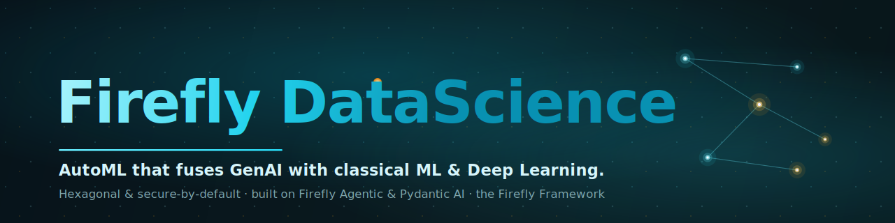
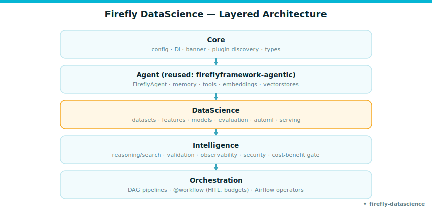
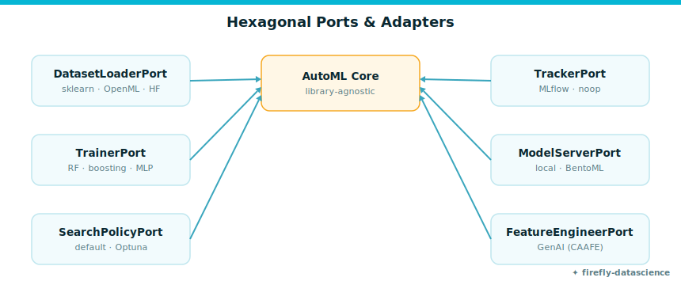
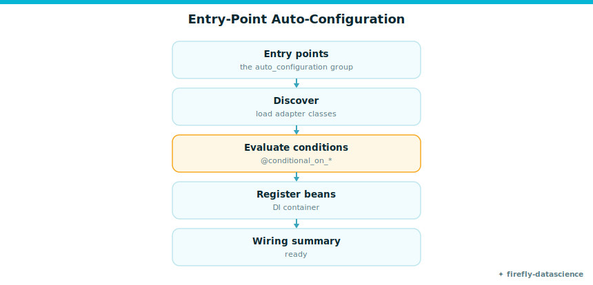
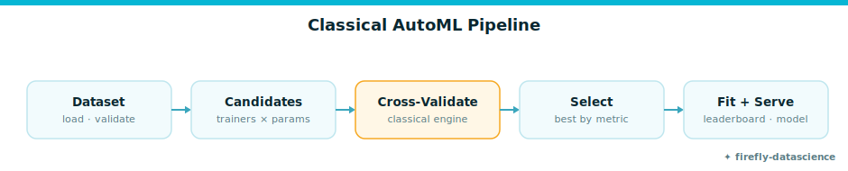
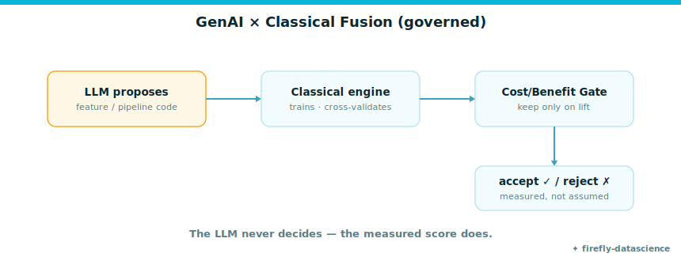
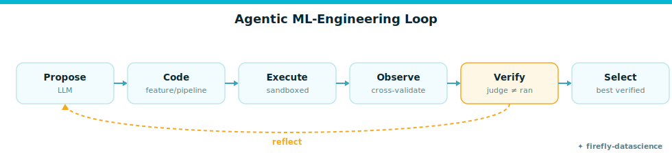
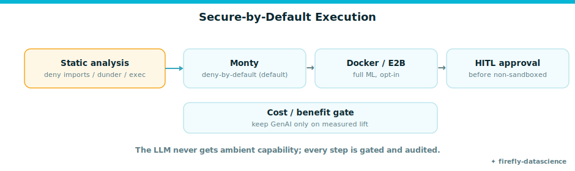
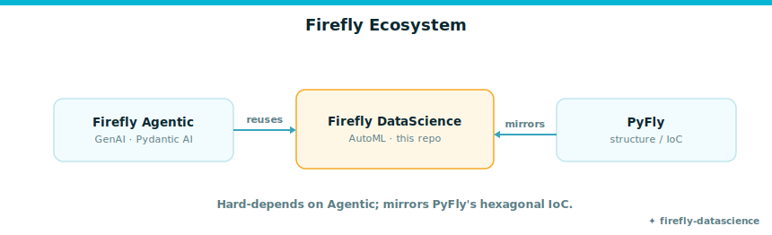

<p align="center">
  
</p>

<h1 align="center">Firefly DataScience</h1>

<p align="center">
  <strong>AutoML that fuses GenAI with classical ML &amp; Deep Learning — hexagonal, secure-by-default, native to the Firefly Framework.</strong>
</p>

<p align="center">
  <a href="#"></a> &nbsp;·&nbsp;
  <a href="LICENSE"></a> &nbsp;·&nbsp;
  <a href="https://github.com/fireflyframework/fireflyframework-agentic"></a> &nbsp;·&nbsp;
  <a href="https://docs.astral.sh/ruff/"></a> &nbsp;·&nbsp;
  <a href="https://microsoft.github.io/pyright/"></a>
</p>

<p align="center">
  <em>The LLM proposes; a deterministic classical engine decides. GenAI is a governed, measurably-gated
  accelerator over a battle-tested classical core — never a black box.</em>
</p>

<p align="center">
  <sub>Copyright 2026 Firefly Software Foundation · Licensed under the Apache License 2.0</sub>
</p>

---

> **Status:** all sub-projects delivered and green (ruff · pyright · 90+ tests). Classical tabular
> AutoML · GenAI feature engineering · the agentic ML-engineering loop · deep learning (PyTorch
> Lightning) + NLP (HuggingFace) + vision · TabFM · serving · the OpenML-AMLB benchmark harness.
> **New here? Start with the [Tutorial](docs/tutorial.md)** or browse the
> **[documentation site](https://fireflyframework.github.io/fireflyframework-datascience/)**.

## What is this?

`fireflyframework-datascience` is a state-of-the-art Python **metaframework for AutoML**. It combines
**GenAI** (built on [`fireflyframework-agentic`](https://github.com/fireflyframework/fireflyframework-agentic),
which wraps [Pydantic AI](https://ai.pydantic.dev/)) with **traditional ML and Deep Learning**, so any
team can apply data science to any project quickly — with production governance, hexagonal
swappability, and security by default.

- **One reproducible pattern.** The LLM proposes code/features/pipelines/seeds; a deterministic
  classical engine trains, scores, and selects; every GenAI step is gated behind a measured
  improvement over a seeded classical baseline.
- **Hexagonal & swappable.** Each ML/MLOps library sits behind a `Protocol` port, so the core stays
  library-agnostic. Adapters that ship today: scikit-learn, XGBoost, LightGBM, CatBoost, TabPFN,
  PyTorch Lightning, HuggingFace, and MLflow. Ports with reference or planned adapters (AutoGluon,
  Feast, BentoML packaging, a model registry) are marked as such in the docs — the seams exist; the
  adapters are landing.
- **Firefly-native.** Auto-configuration, dependency injection, a startup banner + wiring summary,
  CalVer, and the same CI gates as the rest of the Firefly Framework.

## Why it matters

Beyond the engineering, Firefly DataScience is designed to change five things that decide whether data
science actually delivers business value:

- **Faster time-to-value** — AutoML chooses and tunes the model and an agentic loop iterates, so a
  benchmarked, production-grade model is *days* of work, not quarters.
- **Governed GenAI** — the LLM proposes, a deterministic engine measures, and a cost/benefit gate keeps
  only what beats the baseline. Every decision is logged and auditable; no unproven AI output ships.
- **No vendor lock-in** — open (Apache-2.0) and hexagonal: every ML library *and every LLM provider* is
  a swappable adapter, and the whole framework is self-hostable.
- **Lower cost & risk** — classical-first (cheap, reproducible) with secure-by-default execution of any
  generated code; generative AI is used only where it measurably pays.
- **Production-ready** — serving, data validation, lineage and real benchmarks are built in, not bolted on.

**Proven, not promised — unbiased and significance-tested.** Under **nested cross-validation** (no
selection bias), Firefly's AutoML significantly beats a single LogisticRegression (Δ +0.029, *p* = 0.046)
and a single XGBoost (Δ +0.030, ***p* = 7.5e-6**), and is statistically on par with RandomForest —
adapting per dataset, up to **+0.15** on non-linear `phoneme`. With a real LLM (`claude-haiku-4-5`),
governed GenAI feature engineering adds a **significant +0.021** lift on a linear model (*p* = 0.0039) by
rediscovering a withheld driver (`revenue = price × units`) from the schema — and the cost/benefit gate
guarantees it never regresses, at **< $0.01**. Every number is reproducible — see the
[benchmark results](benchmarks/RESULTS.md).

> 📄 **The whole story in one document:** **[The Complete Guide (PDF)](docs/brief/firefly-datascience-complete-guide.pdf)**
> combines the executive summary and strategic case with the architecture, a full hands-on tutorial,
> and the benchmark evidence — for both leaders and engineers.

## Quick start

```bash
uv add 'fireflyframework-datascience[tabular]'        # classical AutoML
# or:  uv add 'fireflyframework-datascience[automl-stack]'   # + TabPFN, MLflow, OpenML
```

Train, rank, and evaluate models in five lines:

```python
from fireflyframework_datascience.automl import AutoML
from fireflyframework_datascience.datasets.adapters import SklearnDatasetLoader

train, test = SklearnDatasetLoader().load("breast_cancer").train_test_split()
result = AutoML().fit(train)               # cross-validates candidates, picks the winner
print(result.leaderboard_table())          # random_forest / linear / hist_gradient_boosting …
print(result.evaluate(test))               # holdout roc_auc ≈ 0.98
```

Boot it as a Firefly application (auto-configuration + dependency injection), or use the CLI:

```bash
firefly-ds doctor       # check your environment & installed adapters
firefly-ds introspect   # boot the app and show discovered auto-configurations
```

Add a real LLM for GenAI feature engineering and the agentic loop — see
[Configuring the LLM](docs/llm-configuration.md). The full guided walkthrough is the
[Tutorial](docs/tutorial.md).

## How it works

### Layered architecture

Five acyclic layers, mirroring `fireflyframework-agentic` with a **DataScience** layer inserted:
`Core → Agent (reused) → DataScience → Intelligence → Orchestration`.

<p align="center">
  
</p>

### Hexagonal ports & adapters

Each ML/MLOps library sits behind a `Protocol` port, so the core stays library-agnostic. Shipping
adapters today: scikit-learn, XGBoost, LightGBM, CatBoost, TabPFN, PyTorch Lightning, HuggingFace,
MLflow. AutoGluon, Feast, BentoML packaging and a model registry are ports with reference/planned
adapters.

<p align="center">
  
</p>

### Auto-configuration

Adapters self-register via entry points and are wired by a type-hint dependency-injection container,
gated by `@conditional_on_*` — exactly like Spring Boot / pyfly.

<p align="center">
  
</p>

### Classical AutoML

<p align="center">
  
</p>

### Governed GenAI × classical fusion

The LLM proposes code/features; a deterministic engine measures; a **cost/benefit gate** keeps only
what beats the seeded baseline. The LLM never decides — the measured score does.

<p align="center">
  
</p>

### The agentic ML-engineering loop

Propose → execute (sandboxed) → observe → **verify** (correctness ≠ ran) → reflect → select.

<p align="center">
  
</p>

### Secure by default

<p align="center">
  
</p>

### Where it fits

<p align="center">
  
</p>

## Documentation

📖 **Full docs site:** <https://fireflyframework.github.io/fireflyframework-datascience/>

| Guide | |
|---|---|
| [Tutorial](docs/tutorial.md) | the guided end-to-end walkthrough (runs offline; tested) |
| [Samples](docs/samples.md) | runnable demos — tutorial, **real-LLM showcase**, finance/retail |
| [Quick Start](docs/quickstart.md) | install, boot, first AutoML run, the `firefly-ds` CLI |
| [Configuring the LLM](docs/llm-configuration.md) | providers, API keys, model selection, cost gating |
| [Architecture](docs/architecture.md) | layers, hexagonal ports, auto-configuration, the DI container |
| [Configuration](docs/configuration.md) | env / `.env` / YAML / profiles precedence |
| [Datasets](docs/datasets.md) | the `Dataset` container and loaders |
| [Classical AutoML](docs/automl.md) | the `AutoML` facade, trainers, search, metrics |
| [GenAI Feature Engineering](docs/genai-features.md) | propose → execute → measure → gate |
| [Agentic ML-Engineering Loop](docs/agentic-loop.md) | propose → verify → reflect → select |
| [Deep Learning & TabFM](docs/deep-learning.md) | MLP, TabPFN, the PyTorch integration point |
| [Serving & Lineage](docs/serving.md) | in-process and gated servers, lineage |
| [Security Model](docs/security.md) | secure code execution, sandbox tiers, prompt-injection defense |
| [Benchmarks](docs/benchmarks.md) | the three-tier AMLB-anchored evaluation strategy |
| [Use Case: Lumen Lending](docs/use-case-lumen.md) | the end-to-end credit-risk walkthrough |

## License

Apache-2.0. Copyright 2026 Firefly Software Foundation.
