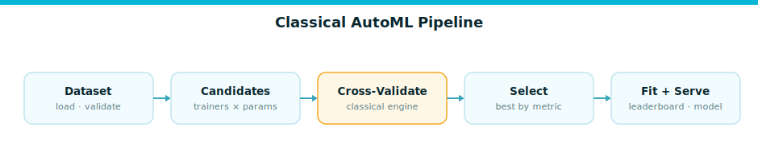

# Classical AutoML

**Cross-validate a panel of tabular models, tune the contenders, and fit the winner — in three lines.**

The `AutoML` engine is the front door of Firefly DataScience. It validates a dataset, cross-validates every
trainer that supports the task (optionally tuning each one), and returns a fitted winner together with the full
leaderboard. It is import-light: scikit-learn is only loaded when you actually call `fit`, so
`from fireflyframework_datascience.automl import AutoML` stays cheap.



## Quick start

```python
from fireflyframework_datascience.automl import AutoML
from fireflyframework_datascience.datasets.adapters import SklearnDatasetLoader

dataset = SklearnDatasetLoader().load("breast_cancer")
train, test = dataset.train_test_split(test_size=0.25)

result = AutoML().fit(train)            # task & metric inferred from the dataset

print(result.best_model.name)           # e.g. "hist_gradient_boosting"
print(result.leaderboard_table())
print(result.evaluate(test))            # EvaluationResult on held-out data
```

`fit` infers the task from `dataset.task` and the default metric from the evaluator (`roc_auc` for binary,
`accuracy` for multiclass, `rmse` for regression). Override either explicitly:

```python
from fireflyframework_datascience.core.types import TaskType

result = AutoML().fit(train, task=TaskType.BINARY, metric="f1")
```

## The fit loop

For each trainer that `supports(task)`, `AutoML`:

1. Builds the trainer's hyperparameter search space (skipped when `n_trials <= 1`).
2. Runs the search policy, whose objective wraps the estimator in a preprocessing pipeline and
   cross-validates it (`cross_val_score`, `cv` folds).
3. Records a `LeaderboardEntry` with the best CV score.
4. Refits the highest-scoring trainer on the full training data and wraps it as a `Model`.

The preprocessing pipeline is built automatically from the column dtypes: numeric columns get median
imputation + `StandardScaler`; categorical columns get most-frequent imputation + `OneHotEncoder`
(`handle_unknown="ignore"`). Scaling is harmless for trees and essential for linear models, so the same
pipeline serves every trainer.

## Configuring the engine

```python
from fireflyframework_datascience.automl import AutoML
from fireflyframework_datascience.models.adapters import (
    RandomForestTrainer,
    HistGradientBoostingTrainer,
    XGBoostTrainer,
)
from fireflyframework_datascience.search.adapters import OptunaSearchPolicy

automl = AutoML(
    trainers=[RandomForestTrainer(), HistGradientBoostingTrainer(), XGBoostTrainer()],
    search_policy=OptunaSearchPolicy(),
    cv=5,
    n_trials=40,
    random_state=42,
)
result = automl.fit(train)
```

The constructor accepts `trainers`, `evaluator`, `search_policy`, `validator`, `tracker`, plus the
`cv`, `n_trials`, and `random_state` knobs. Anything left as `None` falls back to sensible defaults:
`[RandomForestTrainer(), LinearTrainer(), HistGradientBoostingTrainer()]`, the `SklearnMetricsEvaluator`,
and the `DefaultSearchPolicy`.

### DI-wired construction

In an application, resolve the components from a started `ApplicationContext` instead of wiring them by hand:

```python
automl = AutoML.from_context(app, cv=10, n_trials=50)
```

`from_context` pulls every registered `TrainerPort` from the container and resolves the optional
evaluator, search policy, validator, and tracker. Keyword `overrides` win over the resolved components.

## Trainers

Each trainer is a thin adapter that builds an *unfitted* estimator and declares a `ParamSpace`. All of them
support classification and regression and select the right estimator class per task.

| Trainer | `name` | Estimator (clf / reg) | Extra dependency |
| --- | --- | --- | --- |
| `RandomForestTrainer` | `random_forest` | `RandomForest{Classifier,Regressor}` | — (sklearn) |
| `LinearTrainer` | `linear` | `LogisticRegression` / `Ridge` | — (sklearn) |
| `HistGradientBoostingTrainer` | `hist_gradient_boosting` | `HistGradientBoosting{Classifier,Regressor}` | — (sklearn) |
| `XGBoostTrainer` | `xgboost` | `XGB{Classifier,Regressor}` | `xgboost` |
| `LightGBMTrainer` | `lightgbm` | `LGBM{Classifier,Regressor}` | `lightgbm` |
| `CatBoostTrainer` | `catboost` | `CatBoost{Classifier,Regressor}` | `catboost` |

The boosting-library trainers (`xgboost`, `lightgbm`, `catboost`) import their backend lazily, so you only
pay for the extra you install. A trainer exposes three methods used by the engine:

```python
trainer.supports(task)            # -> bool
trainer.make_estimator(task, params)   # -> unfitted estimator
trainer.param_space(task)         # -> ParamSpace
```

## Search policies

A search policy optimizes the cross-validation objective over a trainer's `ParamSpace`. Scores are always
"greater is better" (the evaluator maps loss-style metrics to negated sklearn scorers).

- **`DefaultSearchPolicy`** (`name="default"`) evaluates the estimator's default hyperparameters once — fast
  and fully deterministic. This is the engine default.
- **`OptunaSearchPolicy`** (`name="optuna"`) runs seeded Bayesian optimization (TPE). The space spec drives
  the suggestions; if the space is empty it degrades to a single default evaluation.

```python
from fireflyframework_datascience.search.adapters import OptunaSearchPolicy
from fireflyframework_datascience.tuning import IntParam, FloatParam, CategoricalParam

space = {
    "n_estimators": IntParam(100, 500, step=50),
    "max_depth": IntParam(3, 24),
    "max_features": CategoricalParam(("sqrt", "log2", None)),
}
result = OptunaSearchPolicy().optimize(objective, space, n_trials=40, seed=42)
print(result.best_params, result.best_score, result.n_trials)
```

Both policies return a `SearchResult(best_params, best_score, n_trials)`. The seeded sampler keeps the search
reproducible — classical HPO owns the search, not an LLM.

## Metrics

The default `SklearnMetricsEvaluator` (`name="sklearn"`) supplies CV scoring names and a panel of held-out
metrics:

- **Classification**: `accuracy`, `f1` (weighted), `precision`, `recall`, plus `roc_auc` and `log_loss` when
  probabilities are available.
- **Regression**: `rmse`, `mae`, `r2`.

```python
ev = result.evaluator
ev.default_metric(result.task)        # "roc_auc" for binary
ev.scoring_name(result.task, "f1")    # "f1_weighted" (the CV scorer)
ev.greater_is_better("rmse")          # False
```

## The `AutoMLResult` API

`fit` returns an `AutoMLResult` carrying the fitted winner, the sorted leaderboard, and the evaluator used:

```python
result.best_model        # Model: name, estimator, task, feature_names, params
result.best_score        # top leaderboard cv_score
result.leaderboard       # list[LeaderboardEntry] sorted best-first
result.metric            # primary metric name
result.task              # TaskType

result.predict(test.X)               # winner predictions
result.predict_proba(test.X)         # class probabilities (classification)
eval_result = result.evaluate(test)  # EvaluationResult on a held-out Dataset
print(eval_result.primary_metric, eval_result.primary_value)

print(result.leaderboard_table())    # one line per candidate
```

Each `LeaderboardEntry` holds `model_name`, `params`, `cv_score`, and `metric`, and prints as a tidy
`model_name  metric=score` line. `evaluate` automatically passes probabilities through for classification
when the winning estimator exposes `predict_proba`.

## See also

- [Datasets and loaders](./datasets.md)
- [Models and trainers](./models.md)
- [Hyperparameter tuning](./tuning.md)
- [Evaluation and metrics](./evaluation.md)
- [GenAI + classical fusion](./genai.md)
