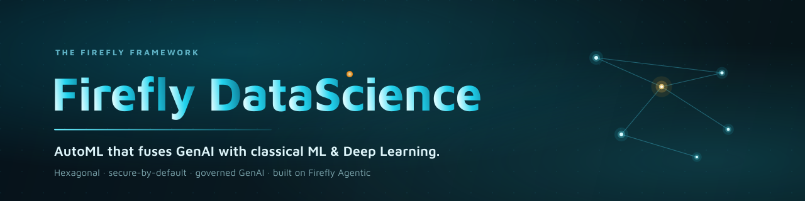

---
hide:
  - toc
---

# Firefly DataScience { .firefly-sr-only }

<div class="firefly-hero" markdown>

{ .firefly-banner }

<div class="firefly-cta" markdown>
[:material-rocket-launch-outline: Quick Start](quickstart.md){ .md-button .md-button--primary }
[:material-school-outline: Tutorial](tutorial.md){ .md-button }
[:material-robot-outline: Configure the LLM](llm-configuration.md){ .md-button }
</div>

</div>

**AutoML that fuses GenAI with classical ML & Deep Learning — hexagonal, secure-by-default, and
native to the Firefly Framework.**

`fireflyframework-datascience` is a state-of-the-art Python metaframework for AutoML. It pairs
**GenAI** — built on [`fireflyframework-agentic`](https://github.com/fireflyframework/fireflyframework-agentic),
which wraps [Pydantic AI](https://ai.pydantic.dev/) — with **traditional ML and Deep Learning**, so
any team can apply data science to any project quickly, with production governance, hexagonal
swappability, and security by default.

!!! firefly "The reproducible pattern — the LLM proposes; the classical engine decides"

    GenAI proposes code, features, pipelines and seeds; a deterministic classical engine trains,
    scores and selects; and **every GenAI step is gated behind a measured improvement over a seeded
    classical baseline**. GenAI is a governed, measurably-gated accelerator over a battle-tested
    classical core — never a black box.

<p align="center">
  
</p>

!!! tip "Want the whole story in one document?"

    **[The Complete Guide (PDF)](brief/firefly-datascience-complete-guide.pdf)** combines the executive
    summary and strategic case (faster time-to-value, governed GenAI, no lock-in) with the full
    architecture, a hands-on tutorial, and the benchmark evidence — one document for both leaders and
    engineers.

## Why Firefly DataScience?

<div class="grid cards" markdown>

-   :material-flask-outline:{ .lg .middle } __Classical-first AutoML__

    ---

    A deterministic engine trains, scores and selects across scikit-learn, XGBoost, LightGBM,
    CatBoost, AutoGluon and TabPFN — reproducible from a seed.

    [:octicons-arrow-right-24: Classical AutoML](automl.md)

-   :material-creation-outline:{ .lg .middle } __GenAI as a gated accelerator__

    ---

    The LLM proposes features and pipelines; nothing ships unless it beats the seeded classical
    baseline (`genai.cost_benefit_gate` is on by default).

    [:octicons-arrow-right-24: GenAI features](genai-features.md)

-   :material-sync:{ .lg .middle } __The agentic ML-engineering loop__

    ---

    Propose → train → score → select, driven by the agentic runtime, with a measured improvement
    required at every step.

    [:octicons-arrow-right-24: Agentic loop](agentic-loop.md)

-   :material-layers-triple-outline:{ .lg .middle } __Deep Learning, swappable__

    ---

    PyTorch Lightning and HuggingFace sit behind the same ports as the classical adapters — tabular,
    text, vision, timeseries and multimodal.

    [:octicons-arrow-right-24: Deep Learning](deep-learning.md)

-   :material-hexagon-outline:{ .lg .middle } __Hexagonal & swappable__

    ---

    Every ML/MLOps library (MLflow, Feast, BentoML, …) is a swappable adapter behind a `Protocol`
    port; the core stays library-agnostic.

    [:octicons-arrow-right-24: Architecture](architecture.md)

-   :material-shield-lock-outline:{ .lg .middle } __Secure by default__

    ---

    LLM-generated code runs in a sandbox (`monty` by default) with timeouts and approval gates;
    GenAI is **off** until you enable it.

    [:octicons-arrow-right-24: Security model](security.md)

-   :material-lightbulb-on-outline:{ .lg .middle } __Explainable & trustworthy__

    ---

    Deterministic global + local feature importances (permutation, SHAP) and **calibrated**
    probabilities — so every model can be explained, and its scores trusted for real decisions.

    [:octicons-arrow-right-24: Explainability](explainability.md)

</div>

## Get started in 30 seconds

=== "Install"

    ```bash
    uv add fireflyframework-datascience                    # core (ports, app, DI — no heavy ML libs)
    uv add 'fireflyframework-datascience[automl-stack]'    # + classical AutoML + tracking
    ```

    Requires **Python 3.13+**. Extras compose, e.g. `[tabular,tracking,genai]`.

=== "Boot the app"

    ```python
    from fireflyframework_datascience import FireflyDataScienceApplication

    # load config -> print banner -> wire DI container -> wiring summary -> ready context
    app = FireflyDataScienceApplication.run()

    print(app.bean_count)                    # number of wired beans
    print(app.config.default_ml_framework)   # "sklearn"
    print(app.applied_auto_configurations)   # discovered auto-configurations
    ```

=== "CLI"

    ```bash
    firefly-ds doctor       # check your environment & installed adapters
    firefly-ds introspect   # boot the app and show discovered auto-configurations
    ```

[Full quick start :octicons-arrow-right-24:](quickstart.md)

GenAI is classical-first and **off by default** — opt in, and require a measured win, explicitly:

```python
config = FireflyDataScienceConfig(app_name="lumen-credit-risk", default_ml_framework="lightgbm")
config.genai.enabled = True              # opt in to the GenAI accelerator
config.genai.cost_benefit_gate = True    # require a measured win over baseline
config.execution.sandbox = "docker"      # sandbox LLM-generated code

app = FireflyDataScienceApplication.run(config=config)
```

## Explore the docs

<div class="grid cards" markdown>

-   :material-hexagon-outline:{ .middle } __[Architecture](architecture.md)__

    ---
    Hexagonal ports/adapters, the DI container, and auto-configuration.

-   :material-rocket-launch-outline:{ .middle } __[Quick Start](quickstart.md)__

    ---
    Install, boot an `ApplicationContext`, run your first AutoML job.

-   :material-tune:{ .middle } __[Configuration](configuration.md)__

    ---
    `FireflyDataScienceConfig`, profiles, env vars, YAML overlays.

-   :material-database-outline:{ .middle } __[Datasets](datasets.md)__

    ---
    Dataset backends (pandas, …) and `Modality`.

-   :material-flask-outline:{ .middle } __[Classical AutoML](automl.md)__

    ---
    Train, score, select — with calibration, stacking ensembles, PR-AUC selection & CV strategies.

-   :material-lightbulb-on-outline:{ .middle } __[Explainability](explainability.md)__

    ---
    Deterministic global + local feature importances (permutation, SHAP).

-   :material-creation-outline:{ .middle } __[GenAI features](genai-features.md)__

    ---
    The gated GenAI accelerator and the cost-benefit gate.

-   :material-sync:{ .middle } __[Agentic loop](agentic-loop.md)__

    ---
    Propose → train → score → select on the agentic runtime.

-   :material-layers-triple-outline:{ .middle } __[Deep Learning](deep-learning.md)__

    ---
    PyTorch Lightning & HuggingFace behind the ports.

-   :material-server-network:{ .middle } __[Serving](serving.md)__

    ---
    Model registry, feature store, and BentoML serving.

-   :material-shield-lock-outline:{ .middle } __[Security](security.md)__

    ---
    Sandboxed code execution, approval gates, secure defaults.

-   :material-chart-line:{ .middle } __[Benchmarks](benchmarks.md)__

    ---
    Reproducible measurement of GenAI vs. classical baselines.

-   :material-bank-outline:{ .middle } __[Use case: Lumen](use-case-lumen.md)__

    ---
    End-to-end lending vertical worked example.

</div>
